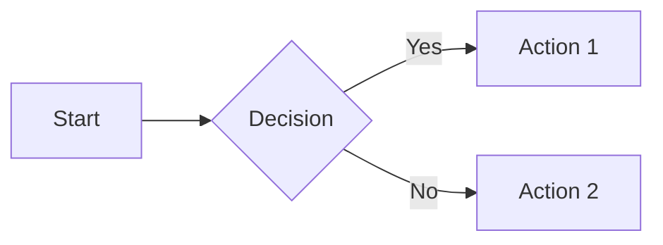
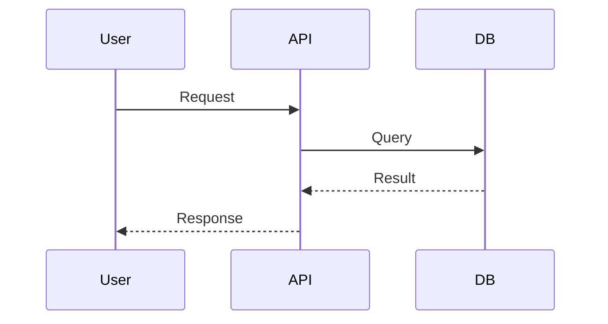
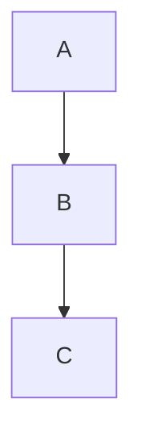

# Advanced Slidev Features

Detailed reference for animations, code features, diagrams, and special syntax.

## Click Animations

### v-click Directive

Make elements appear on click:

```html
<div v-click>Appears on click 1</div>
<div v-click>Appears on click 2</div>
```

### v-after Directive

Appear at the same time as the previous element:

```html
<div v-click>Click 1</div>
<div v-after>Also click 1</div>
```

### v-clicks Component

Apply click animations to all children (perfect for lists):

```markdown
<v-clicks>

- Item 1 (click 1)
- Item 2 (click 2)
- Item 3 (click 3)

</v-clicks>
```

**Props:**
- `depth` - Apply to nested lists
- `every` - Show multiple items per click

### Click Positioning

```html
<!-- Relative positioning -->
<div v-click>Click 1</div>
<div v-click="'+1'">Click 2 (relative)</div>
<div v-click="'-1'">Same as previous</div>

<!-- Absolute positioning -->
<div v-click="3">Appears on click 3</div>
<div v-click="1">Appears on click 1</div>
```

### Hide on Click

```html
<div v-click.hide>Hidden after click</div>
<v-click hide>Also hidden after click</v-click>
```

### Enter & Leave Ranges

Control visibility across click ranges:

```html
<!-- Visible only during clicks 2-3 -->
<div v-click="[2, 4]">
  Appears at click 2, disappears at click 4
</div>
```

## Motion Animations

Using `@vueuse/motion` for movement effects:

```html
<div
  v-motion
  :initial="{ x: -80, opacity: 0 }"
  :enter="{ x: 0, opacity: 1 }"
>
  Slides in from left
</div>
```

### Motion with Clicks

```html
<div
  v-motion
  :initial="{ y: 100 }"
  :click-1="{ y: 0 }"
  :click-2="{ x: 100 }"
  :click-3="{ scale: 1.2 }"
>
  Animates on each click
</div>
```

## Slide Transitions

Set in frontmatter:

```yaml
---
transition: slide-left
---
```

**Built-in transitions:**
- `fade`, `fade-out`
- `slide-left`, `slide-right`, `slide-up`, `slide-down`
- `view-transition` (experimental)

### Different Forward/Backward

```yaml
---
transition: slide-left | slide-right
---
```

## Code Block Features

### Line Highlighting

```markdown
```ts {2,3}
function example() {
  const highlighted = true    // Line 2
  const alsoHighlighted = 1   // Line 3
  return highlighted
}
```
```

### Progressive Line Highlighting

Use `|` to separate click stages:

```markdown
```ts {1|3-4|all}
// Click 1: line 1 highlighted
function add(a: number, b: number) {
  // Click 2: lines 3-4 highlighted
  return a + b
}
// Click 3: all lines highlighted
```
```

### Special Highlighting Keywords

- `{hide}` - Hide the code block initially
- `{none}` - Show code without highlighting
- `{all}` - Highlight all lines

### Line Numbers

```markdown
```ts {lines:true}
const withLineNumbers = true
```
```

Or in headmatter for all code blocks:

```yaml
---
lineNumbers: true
---
```

### Max Height

```markdown
```ts {maxHeight:'200px'}
// Long code block with scroll
```
```

## Magic Move (Animated Code Transitions)

Smooth transitions between code states using four backticks:

````markdown
````md magic-move
```js
// Step 1
const count = 1
```
```js
// Step 2
const count = 2
```
```ts
// Step 3 (different language!)
const count: number = 3
```
````
````

Each click transitions to the next code block with smooth animations.

**With options:**
````markdown
````md magic-move {at:2, lines: true}
```js
// code blocks...
```
````
````

## Monaco Editor (Interactive Code)

Make code blocks editable:

```markdown
```ts {monaco}
// This code is editable during presentation
console.log('Edit me!')
```
```

### Monaco Diff Editor

Compare code versions:

```markdown
```ts {monaco-diff}
// Original
console.log('before')
~~~
// Modified
console.log('after')
```
```

### Monaco Height Control

```markdown
```ts {monaco} {height:'auto'}
// Editor grows as you type
```

```ts {monaco} {height:'300px'}
// Fixed height
```
```

## Mermaid Diagrams

Create diagrams from text:

```markdown

```

### Sequence Diagrams

```markdown

```

### With Configuration

```markdown

```

## LaTeX Math

### Inline Math

```markdown
The formula $E = mc^2$ is famous.
```

### Block Math

```markdown
$$
\begin{aligned}
\nabla \times \vec{E} &= -\frac{\partial \vec{B}}{\partial t} \\
\nabla \times \vec{B} &= \mu_0 \vec{J} + \mu_0 \varepsilon_0 \frac{\partial \vec{E}}{\partial t}
\end{aligned}
$$
```

### Math with Line Highlighting

```markdown
$$ {1|3|all}
\begin{aligned}
x &= 1 \\
y &= 2 \\
z &= x + y
\end{aligned}
$$
```

## Presenter Notes

Add notes visible only in presenter view:

```markdown
---

# Slide Title

Content here

<!--
These are presenter notes.
- Remind to mention X
- Demo Y feature
**Supports markdown!**
-->
```

## Import External Slides

```yaml
---
src: ./pages/intro.md
---
```

## Code Groups (Tabbed Code)

```markdown
<<< @/snippets/example.ts
<<< @/snippets/example.js
```

## Scoped CSS

Style individual slides:

```markdown
---

# Styled Slide

<style>
h1 {
  color: #ff6bed;
}
</style>
```

## Global Styles

In frontmatter for all slides:

```yaml
---
css: unocss
---
```

## When to Use Each Feature

| Need | Feature |
|------|---------|
| Progressive list reveal | `<v-clicks>` |
| Timed element appearance | `v-click` with position |
| Code walkthrough | Line highlighting with `\|` |
| Code evolution demo | Magic Move |
| Live coding | Monaco Editor |
| Architecture diagrams | Mermaid |
| Math formulas | LaTeX `$...$` |
| Slide-specific styling | Scoped `<style>` |
| Movement effects | `v-motion` |
| Speaker reminders | Presenter notes `<!-- -->` |
