# Context Engineering 101

Getting the Best Vue Code out of Claude Code

---
layout: image
image: images/pastAlex.png
backgroundSize: contain
---

---
layout: image
image: images/projects.png
backgroundSize: contain
---

---

what I learnt

- vue best practices
- claude code basics
- how to combine them

---
layout: section
---

# Vue Best Practices

---

# Dumb Components & Composables

**Keep components presentational**

<VClicks>

- Components handle **UI only** — no business logic
- Extract logic into **composables** (`use*.ts`)
- Easy to test, clean structure, modular

</VClicks>

<v-click>

```typescript
// ❌ Logic in component
const handleSubmit = async () => {
  const valid = validateForm(form)
  if (valid) await api.submit(form)
}

// ✅ Logic in composable
const { submit, isValid } = useFormSubmit(form)
```

</v-click>

---

# Testing Strategy

**Focus on integration tests**

| Type | Purpose | Tools |
|------|---------|-------|
| **Integration** | Test real user flows | Vitest + Vue Test Utils |
| **a11y** | Automated accessibility | vitest-axe |
| **Visual regression** | Catch UI changes | Playwright screenshots |

<v-click>

**Why integration over unit?**
- Test components as users experience them
- Less brittle than mocking everything
- Catch real bugs, not implementation details

</v-click>

---

# Clean Codebase Foundation

**AI tools read and mimic your codebase**

<VClicks>

- Files < 600 lines
- Good linting & formatting
- Comprehensive automated tests
- Consistent patterns across the project

</VClicks>

<v-click>

**Why this matters:** Claude learns from your code. Clean patterns in → clean code out.

</v-click>

---
layout: section
---

# Claude Code Basics

---

# The Feature Stack


---

# MCP — Model Context Protocol

**Universal adapter for external tools**

- Connect GitHub, databases, APIs, browsers
- Each server exposes tools as slash commands
- Install: `claude mcp add playwright npx @playwright/mcp@latest`
- Use: `/mcp__playwright__create-test`

⚠️ Each MCP server consumes context — monitor with `/context`

---

# CLI vs MCP Server

**Sometimes a CLI is simpler than an MCP server**

| Approach | Setup | Context Cost |
|----------|-------|--------------|
| GitHub MCP Server | Install server, configure | High |
| `gh` CLI + CLAUDE.md | `brew install gh` | Low |

**Prefer CLI when:**
- Tool has great CLI (`gh`, `docker`, `kubectl`)
- You only need basic operations
- Context budget is tight

**Prefer MCP when:**
- Need structured data responses
- Complex integrations
- No good CLI exists

---

# CLAUDE.md — Project Memory

**Markdown files Claude loads at startup**

Hierarchy (merged top-down):
1. Enterprise → User (`~/.claude/CLAUDE.md`)
2. Project root (`./CLAUDE.md`)
3. Subdirectories (`src/components/CLAUDE.md`)

**Contents:** Commands, coding standards, architecture patterns

---

# Writing a Good CLAUDE.md

**LLMs are stateless** — CLAUDE.md goes into EVERY conversation

**Cover the essentials:**
- **WHAT:** Tech stack, project structure, monorepo layout
- **WHY:** Purpose of the project and its parts
- **HOW:** Build, test, and verification commands

**Best practices:**
- Less is more — LLMs follow ~150 instructions max
- Keep it short — <300 lines (ideally <60)
- Universal content only — skip task-specific stuff
- Progressive disclosure — point to `agent_docs/*.md`
- Don't use Claude as a linter — use real linters
- Don't auto-generate with `/init` — craft it carefully

⚠️ Bad CLAUDE.md affects every single session

---

# Slash Commands

**Explicit, user-triggered workflows**

```
.claude/commands/review.md
```

- `$ARGUMENTS` or `$1`, `$2` for args
- `@file` to inline code
- `allowed-tools:` for pre-execution scripts

**Use for:** Code reviews, commits, scaffolding

---

# Command Structure

```markdown
---
description: Create a git commit
allowed-tools: Bash(git add:*), Bash(git commit:*)
model: haiku
---
```

| Option | Purpose |
|--------|---------|
| `description` | Shown in `/help` |
| `allowed-tools` | Permitted tool access |
| `model` | `haiku` (fast) or `sonnet` (reasoning) |
| `argument-hint` | Expected args in autocomplete |

**Bash execution:** `!git diff` runs first, output injected into prompt

---

# My Git Workflow


---

# The Commands

| Command | Purpose | Model |
|---------|---------|-------|
| `/branch` | Create feature branch from main | haiku |
| `/lint` | Auto-fix linting errors | haiku |
| `/vitest` | Run & fix failing tests | haiku |
| `/commit` | Conventional commit message | haiku |
| `/push` | Stage, commit, push in one step | haiku |
| `/fix-pipeline` | Debug CI failures via `gh` | sonnet |
| `/pr` | Create PR with generated description | haiku |
| `/review-coderabbit` | Address review comments | sonnet |
| `/merge-to-main` | Squash merge & cleanup | haiku |

---

# Subagents

**Specialized AI with isolated context**

```markdown
---
name: security-auditor
tools: Read, Grep, Bash
model: sonnet
---
You are a security-focused code auditor...
```

- Prevents context pollution
- Run in parallel
- Each has own system prompt & tools

---

# The Problem: Context Pollution

**AI defaults to implementation-first**

In a single context window:
- Test writer's analysis bleeds into implementer
- LLM "cheats" — designs tests around planned implementation
- Each phase drags baggage from others

**Solution:** Isolated subagents for each TDD phase

---

# TDD with Skills + Subagents

```mermaid
sequenceDiagram
    participant U as User
    participant S as TDD Skill
    participant TW as Test Writer
    participant I as Implementer
    participant R as Refactorer

    U->>S: "Add feature X"
    S->>TW: Feature requirement
    TW-->>S: ❌ Test fails
    S->>I: Test file path
    I-->>S: ✅ Test passes
    S->>R: Implementation files
    R-->>S: ✅ Refactored
    S-->>U: 🔴→🟢→🔵 Complete
```



---

# The TDD Skill (Orchestrator)

`.claude/skills/tdd-integration/skill.md`

**Auto-triggers on:** "implement", "add feature", "build"

**Phase gates:**
- 🔴 **RED:** Write failing test — do NOT proceed until failure confirmed
- 🟢 **GREEN:** Minimal code to pass — do NOT proceed until test passes
- 🔵 **REFACTOR:** Improve or skip — cycle complete

**Multiple features:** Complete full cycle for EACH before starting next

---

# The Three Agents

| Agent | Phase | Purpose |
|-------|-------|---------|
| `tdd-test-writer` | 🔴 RED | Write failing test |
| `tdd-implementer` | 🟢 GREEN | Minimal code to pass |
| `tdd-refactorer` | 🔵 REFACTOR | Improve or "no changes needed" |

**Key insight:** Each agent has **isolated context**

- Test writer can't see implementation plans
- Implementer only sees the failing test
- Refactorer starts fresh without implementation baggage

---

# Hooks

**Automatic event-driven actions**

Events: `PreToolUse`, `PostToolUse`, `UserPromptSubmit`, `Stop`...

```json
{
  "hooks": {
    "PostToolUse": [{
      "matcher": "Edit|Write",
      "hooks": [{ "type": "command", "command": "pnpm lint" }]
    }]
  }
}
```

**Use for:** Auto-lint, format, validation

---

# Notification Hooks

**Problem:** Constantly checking terminal to see if Claude needs you

**Solution:** `Notification` hook sends desktop alerts

```json
{
  "hooks": {
    "Notification": [{
      "matcher": "permission_prompt|idle_prompt",
      "hooks": [{
        "type": "command",
        "command": "npx tsx .claude/hooks/notify.ts"
      }]
    }]
  }
}
```

| Event | When |
|-------|------|
| `permission_prompt` | Claude needs approval |
| `idle_prompt` | Claude is waiting for input |

**Result:** Notification arrives exactly when you need to engage

---

# Protection Hooks

**Example:** Block editing shadcn/ui components

```json
{
  "hooks": {
    "PreToolUse": [{
      "matcher": "Edit|Write",
      "hooks": [{
        "type": "command",
        "command": "npx tsx .claude/hooks/protect-shadcn.ts"
      }]
    }]
  }
}
```

**The hook:**
- Checks if file is in `src/components/ui/`
- Returns `permissionDecision: 'deny'`
- Message: "Use `npx shadcn-vue@latest add` instead"

**Key:** `PreToolUse` hooks can block actions before they happen

---

# Plugins & Skills

**Plugins** — Shareable bundles of commands, hooks, skills

**Skills** — Auto-activate based on task context

```
.claude/skills/my-skill/SKILL.md
```

| Feature | Triggered By | Context |
|---------|-------------|---------|
| Slash Commands | User | Explicit |
| Subagents | Agent | Isolated |
| Skills | Agent | Automatic |

---

# Quick Reference

| Need | Use |
|------|-----|
| Persistent project context | `CLAUDE.md` |
| Manual workflow | Slash Command |
| Parallel/isolated work | Subagent |
| Auto-enforce standards | Hook |
| Share team config | Plugin |
| External integrations | MCP |
| Auto-apply expertise | Skill |

---
layout: section
---

# Vue + Claude Code

---

# Customize Your Workflow

**With a clean codebase, add Vue-specific tooling:**

| Tool | Purpose |
|------|---------|
| **Slash commands** | Repetitive tasks (`/lint`, `/vitest`) |
| **Subagents** | Specialized work (code review) |
| **Skills** | Auto-activated expertise |

<v-click>

**Example:** Vue Shadcn skill
- Fetches `llms.txt` for component docs
- Claude knows Shadcn patterns automatically

</v-click>

---

# My Vue Workflow


---

# Planning Phase

**Skills auto-activate:** `brainstorm` + `frontend`

1. Describe what you need
2. Claude asks follow-up questions
3. Get detailed plan back
4. **Review plan carefully** before approving

Tests + lint run automatically during implementation

---

# Review & QA Phase

| Step | Action |
|------|--------|
| `/check` | Subagent reviews code |
| `/push` → `/pr` | Commit + create PR |
| Pipeline | CI runs tests |
| CodeRabbit | Automated review |
| `/coderabbit` | Fix valid findings |
| `/fix-pipeline` | Fix CI issues |
| **QA label** | Triggers GitHub Action |

**GitHub Action + Playwright MCP**
→ Claude tests app like a QA dev would

---
layout: section
---

# Spec-Driven Development

---

# Write Clear Acceptance Criteria

**Structure every feature request:**

<VClicks>

- **Given** — Initial state / preconditions
- **When** — User action / trigger
- **Then** — Expected outcome / verification

</VClicks>

<v-click>

```markdown
Given: User is on the dashboard with no tasks
When: User clicks "Add Task" and enters "Buy milk"
Then: Task appears in the list with unchecked status
```

</v-click>

---

# Good vs Bad Specs

<div class="grid grid-cols-2 gap-8">

<div>

### ❌ Vague

```markdown
Add a login page
```

```markdown
Make it look nice
```

```markdown
Fix the bug
```

</div>

<div>

### ✅ Specific

```markdown
Given: Unauthenticated user
When: Submit valid credentials
Then: Redirect to /dashboard
      with session cookie set
```

```markdown
Match Figma design #42
Use primary brand colors
8px border-radius on inputs
```

```markdown
Given: Cart with 2 items
When: Remove item #1
Then: Total updates immediately
      Item count shows "1"
```

</div>

</div>

---

# The Workflow


<v-click>

**The spec is your contract** — Claude can verify its own work

</v-click>

---
layout: end
---

# Key Takeaways

<VClicks>

- **Vue foundation** — Dumb components, composables, good tests
- **Claude Code** — CLAUDE.md, commands, hooks, subagents, skills
- **Combine them** — Spec-driven, automate the boring, isolate context

</VClicks>
